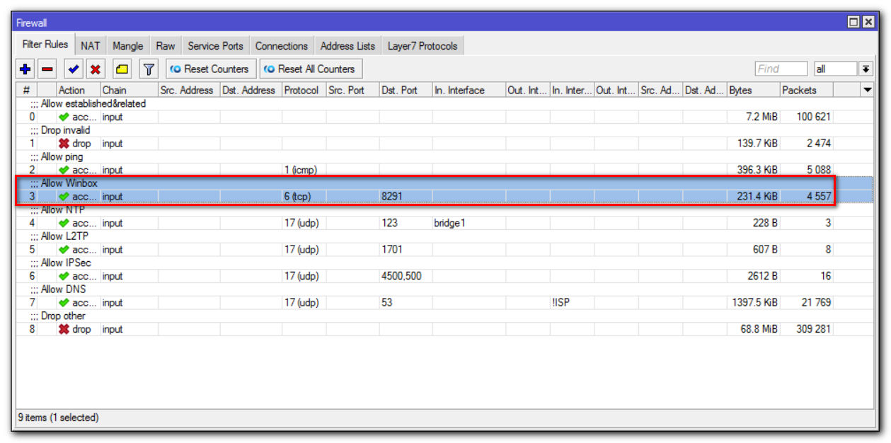

<h1 id="A0">Содержание</h1>
<ol>
  <li><a href="A4">Сброс к заводским настройкам</a></li>
  <li><a href="A1">Доступ снаружи через Winbox</a></li>
  <li><a href="A2">Доступ снаружи через SSH</a></li>
  <li><a href="A3">Доступ снаружи только определенным IP адресам</a></li>
</ol>
<h1 id="A4" align="center">Сброс к заводским настройкам</h1>

+ Нужно выключить питание.
+ Нажать кнопку Reset а роутере
+ Включить питание и дождаться мигания индикатора USER.
+ Отпустить кнопку Reset
<h1 id="A1" align="center">Доступ снаружи через Winbox</h1>

Чтобы подключиться к Микротику через Winbox, нужно в firewall открыть порт 8291. Перейдем IP => Firewall => Filter Rules и нажмем “+”:

 

​
 

​

Разместим созданное правило выше запрещающего:

​

Таким образом, подключение к Mikrotik из интернета через Winbox разрешено. Данный способ позволяет удаленно настраивать оборудование в графическом режиме.

<h1 id="A1" align="center">Доступ снаружи через SSH</h1>

Также удаленное подключение до Mikrotik можно осуществить, используя протокол SSH, настроить и выполнить диагностику устройства из командной строки. Чтобы настроить Mikrotik для удаленного подключения из интернета по протоколу SSH, нужно открыть 22 port. Делается это аналогично настройке доступа через Winbox. Поэтому мы просто скопируем ранее созданное правило, изменив порт:

​

Изменим значение Dst. Port на 22:

​

Разместим его выше блокирующего правила.

<h1 id="A1" align="center">Доступ снаружи только определенным IP адресам</h1>

Откроем IP => Services:

​

В открывшемся окне мы видим название сервисов (Name) и номер порта (Port) которое оно использует. Рекомендуем отключить все сервисы, которыми не собираетесь пользоваться.

Двойным нажатием на строчку сервиса Winbox, откроем его настройки и приведем к следующему виду:

​

Где:
+ Name: Winbox – название сервиса;
+ Port: 8291 – номер порта, который использует сервис. При желании можем указать свой;
+ Available From: 192.168.13.0/24 – разрешаем подключение из локальной сети;
+ 1.1.1.1 – вместо этого указываем IP-адрес с которого будем подключаться к оборудованию.

# Source
+ [Настройка DNS Server на MikroTik](https://smartadm.ru/nastrojka-dns-server-na-mikrotik/)
+ [Базовая настройка фаервола в Микротик](https://system-administrators.info/?p=7261)
+ [Настройка MikroTik L2TP Server + IPSec](https://smartadm.ru/mikrotik-l2tp-server-ipsec/)
+ [Выбираем логин на Яндекс.Почте](https://habr.com/ru/post/582816/)
+ [Встречаем сервис от Cloudflare](https://habr.com/ru/post/352654/)
+ [Настраиваем использование DNS over HTTPS (DoH)](https://interface31.ru/tech_it/2021/01/nastraivaem-ispolzovanie-dns-over-https-doh-na-routerah-mikrotik.html)
+ [Настройка почты и отправка письма по событию](https://smartadm.ru/mikrotik-nastrojka-pochty/)
+ [Правильная настройка безопасности роутера](https://smartadm.ru/mikrotik-nastrojka-firewall/)
+ [Расширенная настройка DNS и DHCP в роутерах Mikrotik](https://interface31.ru/tech_it/2019/05/rasshirennaya-nastroyka-dns-i-dhcp-v-routerah-mikrotik.html)
+ 
+ 
