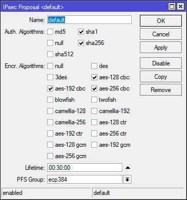
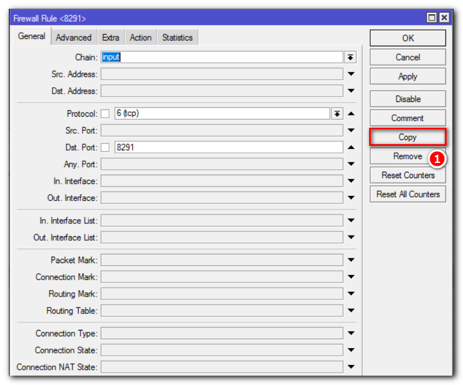

<h2>Содержание</h2>
<ol>
  <li><a href="#Сброс-к-заводским-настройкам">Сброс к заводским настройкам</a></li>
  <li><a href="#Настройка-VPN">Настройка VPN</a></li>
  <li><a href="#Доступ-снаружи-через-Winbox">Доступ снаружи через Winbox</a></li>
  <li><a href="#Доступ-снаружи-через-SSH">Доступ снаружи через SSH</a></li>
  <li><a href="#Доступ-снаружи-только-определенным-IP-адресам">Доступ снаружи только определенным IP адресам</a></li>
</ol>

# Сброс к заводским настройкам

+ Нужно выключить питание.
+ Нажать кнопку Reset а роутере
+ Включить питание и дождаться мигания индикатора USER.
+ Отпустить кнопку Reset

По-умолчанию настройки роутера:
+ адрес 192.168.88.1
+ Wifi имя сети: MikroTik-C963D4 открытая
+ login: admin
+ password: пустое поле

# SSL Сертификат для субдомена

/certificate enable-ssl-certificate dns-name=childrenyard.ru

# Настройка VPN

1. IP - Pool / Определям диапазон адресов VPN-пользователей

2. «Связать» пул адресов для клиентов и адрес VPN-сервера можно с помощью PPP-профиля:

**General:**
- Name: default-encryption — имя профиля, используем уже созданный стандартный для этого дела
- Local Address: default-dhcp — задаем адрес VPN-сервера в локальной сети
- Remote address: VPN
- Bridge Learning: default
- Change TCP MSS: yes

**Protocols:**
- Use MPLS: no — не используем MultiProtocol Label Switching
- Use compression: yes — включаем сжатие трафика
- Use Encryption: yes — включаем шифрование

**Limits:**
Only one: no — разрешаем более одного одновременного подключения для пользователя

3. Далее необходимо разрешить клиенту выходить в интернет через VPN-подключение. Для этого необходимо настроить NAT.

3. PPP - Secrets / Готовим пользователя VPN

4. PPP - Interface - клик на L2TP Server / Включаем сервер L2TP

5. Переходим в IP - IPsec - Proposal и приводим набор настроек default к следующему виду: Auth. Algorithms - sha1, sha256, Encr. Algorithms - aes-128-cbc, aes-192-cbc, aes-256-cbc, PFS Group - ecp384.

# Доступ снаружи через Winbox

Чтобы подключиться к Микротику через Winbox, нужно в firewall открыть порт 8291. Перейдем IP => Firewall => Filter Rules и нажмем “+”:

 

​
 

​

Разместим созданное правило выше запрещающего:

​

Таким образом, подключение к Mikrotik из интернета через Winbox разрешено. Данный способ позволяет удаленно настраивать оборудование в графическом режиме.

# Доступ снаружи через SSH

Также удаленное подключение до Mikrotik можно осуществить, используя протокол SSH, настроить и выполнить диагностику устройства из командной строки. Чтобы настроить Mikrotik для удаленного подключения из интернета по протоколу SSH, нужно открыть 22 port. Делается это аналогично настройке доступа через Winbox. Поэтому мы просто скопируем ранее созданное правило, изменив порт:

​

Изменим значение Dst. Port на 22:

​

Разместим его выше блокирующего правила.

Доступ снаружи только определенным IP адресам

Откроем IP => Services:

​

В открывшемся окне мы видим название сервисов (Name) и номер порта (Port) которое оно использует. Рекомендуем отключить все сервисы, которыми не собираетесь пользоваться.

Двойным нажатием на строчку сервиса Winbox, откроем его настройки и приведем к следующему виду:

​

Где:
+ Name: Winbox – название сервиса;
+ Port: 8291 – номер порта, который использует сервис. При желании можем указать свой;
+ Available From: 192.168.13.0/24 – разрешаем подключение из локальной сети;
+ 1.1.1.1 – вместо этого указываем IP-адрес с которого будем подключаться к оборудованию.

# Source
+ [Настройка DNS Server на MikroTik](https://smartadm.ru/nastrojka-dns-server-na-mikrotik/)
+ [Базовая настройка фаервола в Микротик](https://system-administrators.info/?p=7261)
+ [Настройка MikroTik L2TP Server + IPSec](https://smartadm.ru/mikrotik-l2tp-server-ipsec/)
+ [Выбираем логин на Яндекс.Почте](https://habr.com/ru/post/582816/)
+ [Встречаем сервис от Cloudflare](https://habr.com/ru/post/352654/)
+ [Настраиваем использование DNS over HTTPS (DoH)](https://interface31.ru/tech_it/2021/01/nastraivaem-ispolzovanie-dns-over-https-doh-na-routerah-mikrotik.html)
+ [Настройка почты и отправка письма по событию](https://smartadm.ru/mikrotik-nastrojka-pochty/)
+ [Правильная настройка безопасности роутера](https://smartadm.ru/mikrotik-nastrojka-firewall/)
+ [Расширенная настройка DNS и DHCP в роутерах Mikrotik](https://interface31.ru/tech_it/2019/05/rasshirennaya-nastroyka-dns-i-dhcp-v-routerah-mikrotik.html)
+ 
+ 
